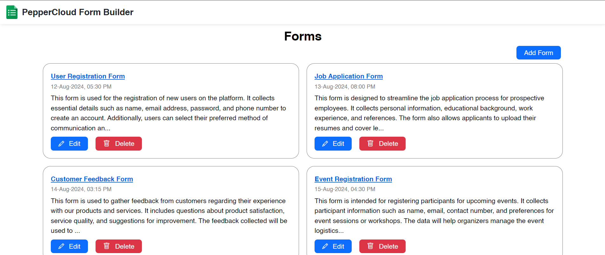
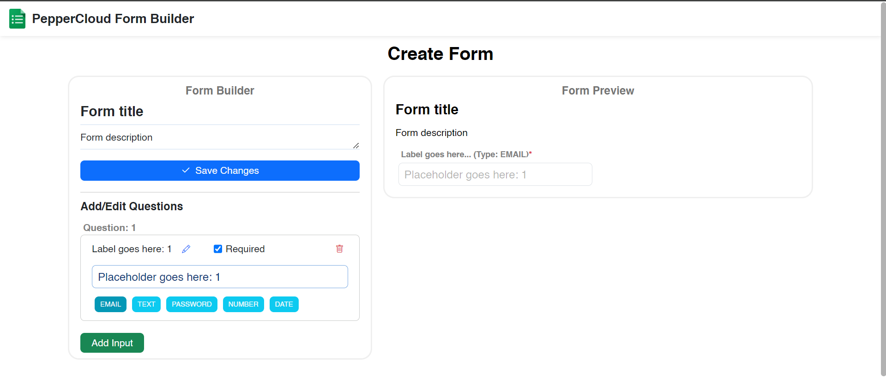
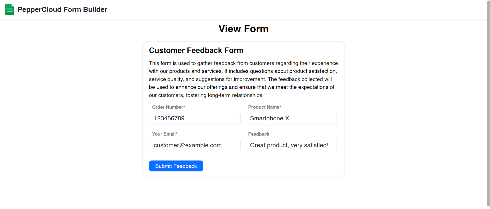
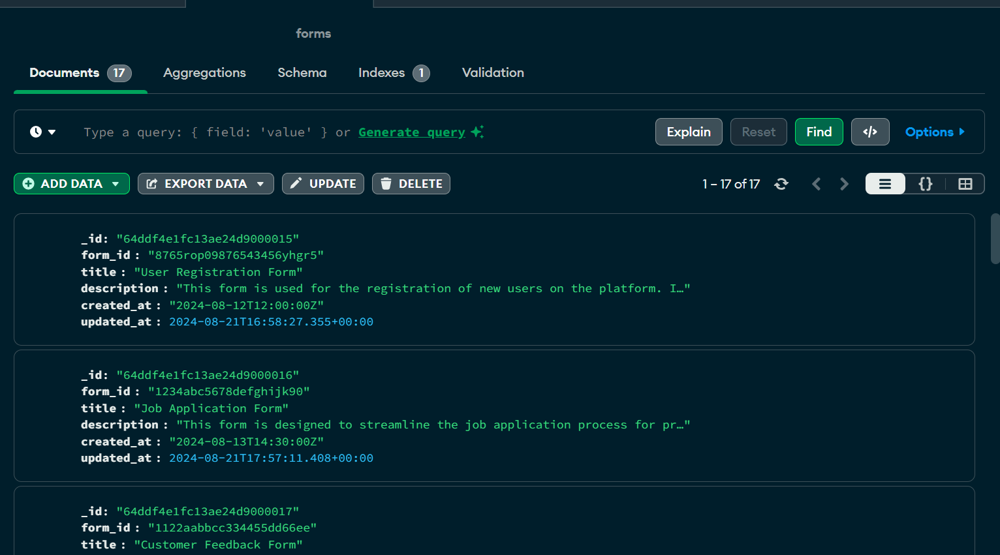
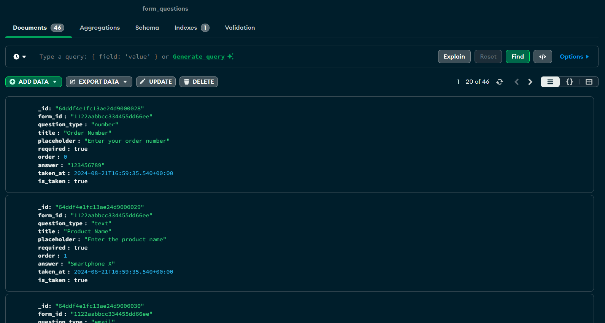

# Form Builder Application (MERN Stack)

## Project Overview

This project is a full-stack MERN application that allows users to create, edit, view, and manage forms. The application will be built using React.js for the frontend, Node.js with Express.js for the backend, MongoDB for the database, and will be deployed using Netlify (frontend), Render (backend), and MongoDB Atlas (cloud database).
[Netlify demo link](https://peppercloud-formbuilder.netlify.app/)

## Features

- Create, edit, and view forms.
- Supports various input types: Email, Text, Password, Number, Date.
- Group inputs into sections (optional).

## Technologies Used

- **Frontend**: React.js, React Router
- **Backend**: Node.js, Express.js
- **Database**: MongoDB Atlas
- **Deployment**:
  - **Frontend**: Netlify
  - **Backend**: Render
  - **Database**: MongoDB Atlas

## Installation
1. Clone the repository:
    ```bash
    git clone https://github.com/ninjapanther72/peppercloud_formbuilder.git
    cd form-builder-frontend
    ```

### Run Frontend
1. Install dependencies:
    ```bash
    npm install
    ```
2. Run the development server:
    ```bash
    npm start
    ```

### Run Backend
1. Install dependencies:
    ```bash
    npm install
    ```
2. Set up environment variables in `.env`:
    ```env
    MONGO_URI=your-mongodb-uri
    ```
3. Start the server:
    ```bash
    node server.js
    ```

## Deployment

### Frontend (Netlify)

1. Push your frontend code to GitHub.
2. Connect your repository to Netlify.
3. Set the build command to `npm run build`.
4. Set the publish directory to `build`.
5. Deploy the site.

### Backend (Render)

1. Push your backend code to GitHub.
2. Connect your repository to Render.
3. Set the start command to `node server.js`.
4. Set up the environment variable `MONGO_URI`.
5. Deploy the service.

### Database (MongoDB Atlas)

1. Create a free MongoDB cluster on MongoDB Atlas.
2. Create a new database and collection.
3. Obtain the connection string and add it to your `.env` file.

## Usage

1. Navigate to the homepage to view all forms.
2. Click "Create Form" to build a new form.
3. Edit and view forms using the respective pages.
4. Use drag-and-drop to rearrange inputs (optional).


# Project Images

1. Project Logo


2. Home Page


3. Add Form Page


4. Edit Form Page


5. View/Submit Form Page


6. MongoDB Database - Forms Schema


7. MongoDB Database - Form-Questions Schema



## Database files

1. Forms data json-file
[](./db/Forms.json)
2. Form-questions data json-file
[](./db/Forms_qs.json)


## License

This project is licensed under the MIT License.
